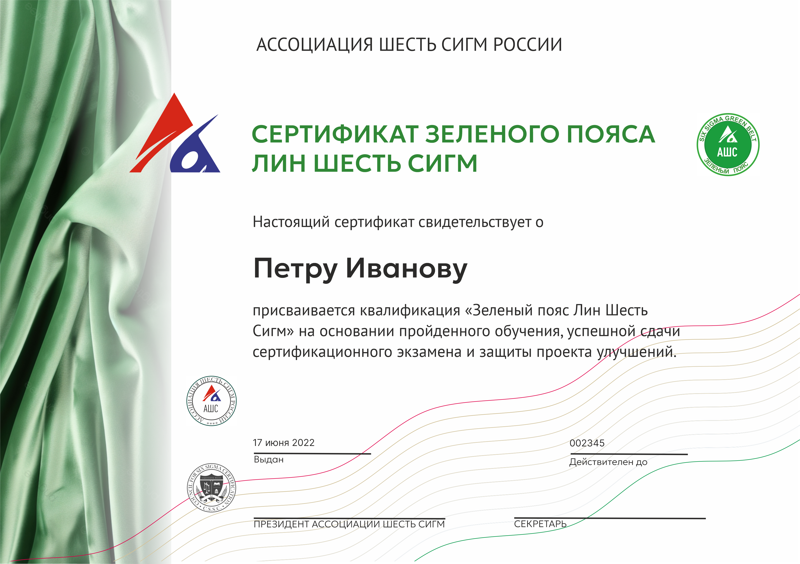


**Очный интенсивный тренинг «Зелёный пояс Lean Six Sigma»**  
5 дней полного погружения + 6 месяцев сопровождения проектов + сертификация  
(5 дней, 40 астрономических часов)


### Формат и условия

- **Формат** — очный  
- **Продолжительность** — 5 дней (40 астрономических часов)  
- **Размер группы** — до 15 человек  
- **Целевая аудитория** — руководители и ключевые специалисты, которые будут вести проекты по оптимизации процессов  
- **Стоимость** — **1 150 000 ₽** за группу (НДС не облагается / уточняйте)  
  Проезд и проживание тренера — за счёт заказчика


**В стоимость включено:**
- Полный комплект материалов (электронные + рабочие тетради + учебник «Шесть Сигм»)
- Обучение сертифицированными Мастерами-Чёрными поясами
- 6 месяцев дистанционного сопровождения проектов
- Сертификационный экзамен
- Ассессмент и защита одного проекта на участника
- Именной сертификат **«Зелёный пояс Lean Six Sigma»** (2 года → бессрочный после защиты проекта)


**Особое условие**  
Для сотрудников, уже прошедших тренинг «Кайдзен-менеджер и инструменты бережливого производства», при успешной защите проекта по DMAIC возможна **международная сертификация CSSC** (Council for Six Sigma Certification).

### Программа тренинга (5 дней)

**День 1 · DEFINE — Определение**  
Философия и экономика Lean Six Sigma · Вариативность процессов · Выбор проекта · SIPOC · VOC · Project Charter  
**Практикум:** разработка устава реального проекта участника

**День 2 · MEASURE — Измерение**  
Основы статистики · Картирование процесса · План сбора данных · MSA · Yield, DPMO, Sigma Level · Cp/Cpk · Control Charts  
**Практикум:** план сбора данных и анализ текущего состояния процесса

**День 3 · ANALYZE — Анализ**  
Гипотезы · Диаграмма Исикавы · 5 Why · Регрессия · t-тест, ANOVA, Хи-квадрат  
**Специальный модуль (2–3 часа):** Применение ИИ в проектах Lean Six Sigma  
**Практикум:** статистическое подтверждение коренных причин

**День 4 · IMPROVE — Улучшение**  
Мозговой штурм · ТРИЗ · Pugh Matrix · Пилотное внедрение · Расчёт экономического эффекта  
**Практикум:** план внедрения улучшений

**День 5 · CONTROL — Контроль + сертификация**  
Стандартизация · Контрольные листы · План реагирования на риски · Отчёт по проекту  
**Сертификационный экзамен** · Консультация по реализации

### Модуль «Применение ИИ в проектах Lean Six Sigma» (День 3)

- Обзор ML и ИИ в промышленности  
- Прогнозная аналитика (Random Forest, Gradient Boosting) → поиск нелинейных зависимостей  
- Анализ Big Data и неструктурированных данных (логи, отзывы, IoT)  
- Компьютерное зрение для контроля качества  
- Реальные кейсы: сокращение времени анализа на 40%  
- Доступные инструменты: Power BI, Python-библиотеки, Azure ML, AWS SageMaker

### Сертификат

**Сертификация**  
После завершения обучения, сдачи сертификационного экзамена и защиты учебного проекта по DMAIC вы получаете именной сертификат **«Зелёный пояс Lean Six Sigma»** Ассоциации Шесть Сигм.


   Запись по телефону: +7 (977) 517-58-57    
  Написать на email g_buzov@mail.ru


